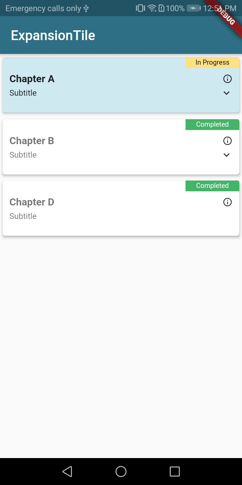
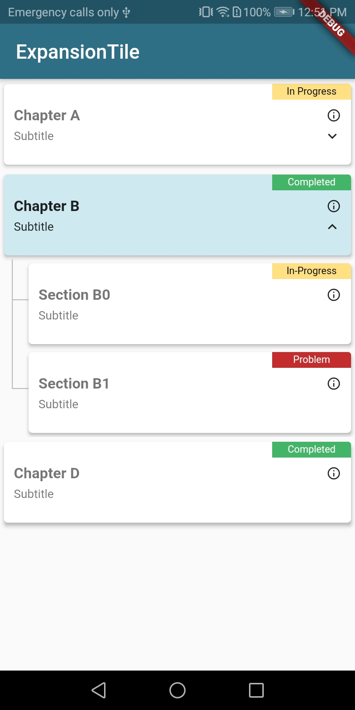
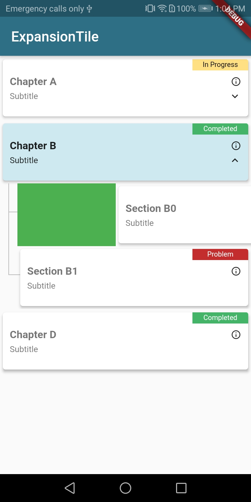
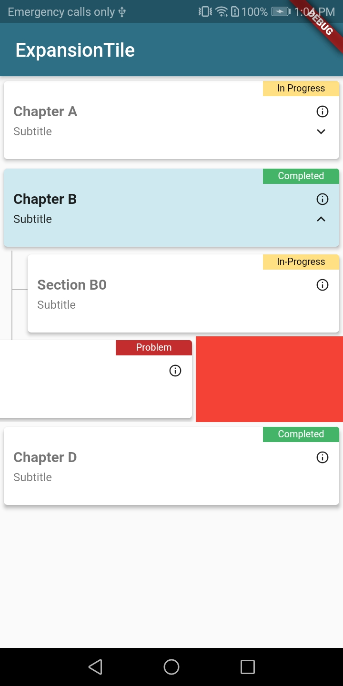

# Dismissible Expanded List

A Flutter package to provide an ability to display hierarchical data in the form of list as well as allows to swipe the individual tiles.

## Getting Started

Dismissible Expanded List is written in dart. It provides us an ability to display hierarchical data in the form of list as well as allowing us to swipe the individual tiles. Tapping a tile expands or collapses the view of its children. When a tile is collapsed its children are disposed so that the widget footprint of the list only reflects what’s visible. 

User can enable/disable swipe functionality for parent or child items by providing simple configurations. A complete list of configurable params is mentioned below.

## Demo

<p>
  
  
  
  
</p>


Use this package as a library
-----------------------------

**1. Depend on it**

Add this to your package's pubspec.yaml file:

```
dependencies:
  dismissible_expanded_list: ^0.2.x
```

**2. Install it**

You can install packages from the command line:

with Flutter

```
$ flutter packages get
```

Alternatively, your editor might support flutter packages get. Check the docs for your editor to learn more.

**3. Import it**

Now in your Dart code, you can use:

```
import 'package:dismissible_expanded_list/dismissible_expanded_list.dart';
```

How to use
----------

Using Dismissible Expanded List is quite easy, all you need to do is 


```dart
return ListView.builder(
    itemBuilder: (BuildContext context, int index) =>
        DismissibleExpandableList(
      parentIndex: index,
      entry: list[index],
      config: config,
      onItemClick: (parentIndex, childIndex, ExpandableListItem item) {
        print('onItemClick called');
        onItemClick(parentIndex, childIndex);
      },
      onItemDismissed:
          (parentIndex, childIndex, direction, removeTileOnDismiss, item) {
        if (direction == DismissDirection.endToStart) {
          onItemDismissed(parentIndex, childIndex, removeTileOnDismiss);
        } else {
          onItemDismissed(parentIndex, childIndex, removeTileOnDismiss);
        }
      },
    ),
    itemCount: mockData.length,
  );
```

How to Configure
----------------

```dart
/// Configuration example
DismissibleListConfig config = DismissibleListConfig()
  ..badgeWidth = 80.0
  ..listTileHeight = 80.0
  ..listTileChildHeight = 90.0
  ..listElevation = 3.0
  ..infoBadgeElevation = 0.0
  ..infoIconSize = 15.0
  ..removeTileOnDismiss = false
  ..allowBatchSwipe = true
  ..allowChildSwipe = true
  ..allowParentSelection = true
  ..showBorder = false
  ..showInfoBadge = true
  ..titleStyle = TextStyles.title
  ..titleSelectedStyle = TextStyles.titleSelected
  ..subTitleStyle = TextStyles.subTitle
  ..subTitleSelectedStyle = TextStyles.subTitleSelected
  ..trailingIcon = Icons.info_outline
  ..lineColor = Colors.grey[400]
  ..selectionColor = Color(0xFFcee9f0)
  ..rightSwipeColor = Colors.green
  ..leftSwipeColor = Colors.red
  ..iconColor = Colors.black87
  ..iconSelectedColor = Colors.black87
  ..backgroundColor = Colors.white;
```

List of params
--------------

| Property              | Type                  | Default Value               | Description                                                                                                                                                                                                                                                                           |
|-----------------------|-----------------------|-----------------------------|---------------------------------------------------------------------------------------------------------------------------------------------------------------------------------------------------------------------------------------------------------------------------------------|
| badgeWidth            | double                | 80.0                        | The (optional) param to control badge width displayed at the top right.  

| listTileHeight        | double                | 80.0                        | The (optional) param to control list tile height. 

| listTileChildHeight   | double                | 80.0                        | The (optional) param to control list tile children height.                                                                                                                                                                                                              |
| infoBadgeElevation    | double                | 0.0                         | The (optional) param to control the card elevation for info badge displayed at the top right.                                                                                                                                                                                         |
| listElevation         | double                | 3.0                         | The (optional) param to control the card elevation for dismissible list item.                                                                                                                                                                                                         |
| infoIconSize          | double                | 15.0                        | The (optional) param to control the size of info icon displayed in-front of the title.                                                                                                                                                                                                |
| removeTileOnDismiss   | bool                  | true                        | The (optional) param to control either to remove dismissible list items from list or to keep them. If `true` item will be remove from the list and the rest of the items will adjust accordingly, else item will stay at its place and a callback with swiped item will be returned.  |
| allowBatchSwipe       | bool                  | true                        | The (optional) param to control parent/batch swipe at once. If `true` parent/batch will be swiped and removed from list, else it wont and will act as a normal list item.                                                                                                             |
| allowChildSwipe       | bool                  | true                        | The (optional) param to control child swipe. If `true` user will be able to swipe the child else it won't and will act as a normal list item.                                                                                                                                         |
| allowParentSelection  | bool                  | true                        | The (optional) param to control parent selection. If `true` by selecting a child parent will also be selected else only child will show as selected.                                                                                                                                  |
| showBorder            | bool                  | false                       | The (optional) param to add an extra border between expanded and other list items when one of the list item is expanded. If `true` an extra border will be added to top and bottom of expanded item to distinguish it from other items else there will be no boarder.                 |
| showInfoBadge         | bool                  | true                        | The (optional) param to control either to show info badge or not. if `true` info badge will be displayed at the top right corner of the dismissible list item.                                                                                                                        |
| titleStyle            | TextStyle             | TextStyles.title            | The (optional) param to set font style of the title.                                                                                                                                                                                                                                  |
| titleSelectedStyle    | TextStyle             | TextStyles.titleSelected    | The (optional) param to set selected font style of the title.                                                                                                                                                                                                                         |
| subTitleStyle         | TextStyle             | TextStyles.subTitle         | The (optional) param to set font style of the sub-title.                                                                                                                                                                                                                              |
| subTitleSelectedStyle | TextStyle             | TextStyles.subTitleSelected | The (optional) param to set selected font style of the sub-title.                                                                                                                                                                                                                     |
| trailingIcon          | IconData              | Icons.info_outline          | The (optional) param to set the trailing icon.                                                                                                                                                                                                                                        |
| topLeftIcon           | IconData              | Icons.info_outline          | The (optional) param to set the icon at the top left corner of the list tile.                                                                                                                                                                                                                                        |
| bottomLeftIcon        | IconData              | Icons.info_outline          | The (optional) param to set the icon at the bottom left corner of the list tile.                                                                                                                                                                                                                                        |
| bottomRightIcon       | IconData              | Icons.info_outline          | The (optional) param to set the icon at the bottom right corner of the list tile.                                                                                                                                                                                                                                        |
| lineColor             | Color                 | Colors.grey[400]            | The (optional) param to set the line color of the expanded list item.                                                                                                                                                                                                                 |
| selectionColor        | Color                 | Color(0xFFcee9f0)           | The (optional) param to set the list item selection color.                                                                                                                                                                                                                            |
| rightSwipeColor       | Color                 | Colors.green                | The (optional) param to set the swipe color of the list item when swiped from left to right.                                                                                                                                                                                          |
| leftSwipeColor        | Color                 | Colors.red                  | The (optional) param to set the swipe color of the list item when swiped from right to left.                                                                                                                                                                                          |
| iconColor             | Color                 | Colors.black87              | The (optional) param to set the trailing icon color.                                                                                                                                                                                                                                  |
| iconSelectedColor     | Color                 | Colors.black87              | The (optional) param to set the trailing icon color when list item is selected.                                                                                                                                                                                                       |
| backgroundColor       | Color                 | Colors.white                | The (optional) param to set the background color of list item.                                                                                                                                                                                                                        |
| cornerBackgroundColor | Color                 | Color(0xFFf3f3f3)           | The (optional) param to set the background color of corners.
| cornerSelectionColor  | Color                 | Color(0xFFf3f3f3)           | The (optional) param to set the selection color of corners.
| parentIndex           | int                   | null                        | The (required) param to populate list item data.                                                                                                                                                                                                                                      |
| entry                 | ExpandableListItem    | null                        | The (required) param to populate list item data.                                                                                                                                                                                                                                      |
| config                | DismissibleListConfig | null                        | The (required) param to set the dismissible list item configuration. e.g. background color, trailing icon size etc.                                                                                                                                                                   |
| onItemClick           | OnItemClick           | null                        | The (optional) param to get the call back whenever list item will be tapped.                                                                                                                                                                                                          |
| onItemDismissed       | OnItemDismissed       | null                        | The (optional) param to get the call back whenever list item will be swiped.                                                                                                                                                                                                          |
| icons                 | List<Icon>            | null                        | The (optional) param to show info icons under subtitle                                                                                                                                                                                                          |


Complete Example
----------------

```dart
import 'package:dismissible_expanded_list/constants/text_styles.dart';
import 'package:dismissible_expanded_list/widgets/dismissible_expanded_list_widget.dart';
import 'package:dismissible_expanded_list/model/entry.dart';
import 'package:example/mock.dart';
import 'package:flutter/material.dart';
import 'package:dismissible_expanded_list/model/dismissible_list_configuration.dart';

void main() {
  runApp(MyApp());
}

class MyApp extends StatelessWidget {
  @override
  Widget build(BuildContext context) {
    return new MaterialApp(
      home: ExpansionTileSample(),
    );
  }
}

class ExpansionTileSample extends StatefulWidget {
  @override
  _ExpansionTileSampleState createState() => _ExpansionTileSampleState();
}

class _ExpansionTileSampleState extends State<ExpansionTileSample> {
  String title = 'Not Yet Selected';
  String selectedId = '1';
  bool removeTileOnDismiss = true;

  final List<ExpandableListItem> list = mockData;

  @override
  Widget build(BuildContext context) {
    return MaterialApp(
      home: Scaffold(
        appBar: AppBar(
          backgroundColor: Color(0xFF2e6f85),
          title: const Text('ExpansionTile'),
        ),
        body: Material(
          child: MediaQuery.of(context).orientation == Orientation.landscape
              ? Row(
                  children: <Widget>[_buildLeftSide(), _buildRightSide()],
                )
              : Row(
                  children: <Widget>[_buildRightSide()],
                ),
        ),
      ),
    );
  }

  Widget _buildRightSide() {
    /// Configuration example
    DismissibleListConfig config = DismissibleListConfig()
      ..badgeWidth = 80.0
      ..listTileHeight = 80.0
      ..listTileChildHeight = 90.0
      ..listElevation = 3.0
      ..infoBadgeElevation = 0.0
      ..infoIconSize = 15.0
      ..removeTileOnDismiss = false
      ..allowBatchSwipe = true
      ..allowChildSwipe = true
      ..allowParentSelection = true
      ..showBorder = false
      ..showInfoBadge = true
      ..titleStyle = TextStyles.title
      ..titleSelectedStyle = TextStyles.titleSelected
      ..subTitleStyle = TextStyles.subTitle
      ..subTitleSelectedStyle = TextStyles.subTitleSelected
      ..trailingIcon = Icons.info_outline
      ..lineColor = Colors.grey[400]
      ..selectionColor = Color(0xFFcee9f0)
      ..rightSwipeColor = Colors.green
      ..leftSwipeColor = Colors.red
      ..iconColor = Colors.black87
      ..iconSelectedColor = Colors.black87
      ..backgroundColor = Colors.white;

    return Expanded(
      flex: 1,
      child: ListView.builder(
        itemBuilder: (BuildContext context, int index) =>
            DismissibleExpandableList(
          parentIndex: index,
          entry: list[index],
          config: config,
          onItemClick: (parentIndex, childIndex, ExpandableListItem item) {
            print('onItemClick called');
            onItemClick(parentIndex, childIndex);
          },
          onItemDismissed:
              (parentIndex, childIndex, direction, removeTileOnDismiss, item) {
            if (direction == DismissDirection.endToStart) {
              onItemDismissed(parentIndex, childIndex, removeTileOnDismiss);
            } else {
              onItemDismissed(parentIndex, childIndex, removeTileOnDismiss);
            }
          },
        ),
        itemCount: mockData.length,
      ),
    );
  }

  Widget _buildLeftSide() {
    return Expanded(
      flex: 2,
      child: Container(
        margin: EdgeInsets.only(left: 5.0, top: 5.0, bottom: 5.0, right: 2.0),
        height: double.infinity,
        decoration: BoxDecoration(
            color: Colors.white, borderRadius: BorderRadius.circular(10.0)),
        child: Text(title),
      ),
    );
  }

  // general methods:-----------------------------------------------------------
  void onItemClick(int parentIndex, int childIndex) {
    setState(
      () {
        if (childIndex == -1) {
          title = mockData[parentIndex].title;
          selectedId = mockData[parentIndex].id;

          // setting entry to true
          mockData.forEach((item) => item.reset());
          mockData[parentIndex].selected = true;
        } else {
          selectedId = mockData[parentIndex].children[childIndex].id;
          title = mockData[parentIndex].children[childIndex].title;

          // setting entry to true
          mockData.forEach((item) => item.reset());
          mockData[parentIndex].selected = true;
          mockData[parentIndex].children[childIndex].selected = true;
        }
      },
    );
  }

  void onItemDismissed(
      int parentIndex, int childIndex, bool removeTileOnDismiss) {
    setState(
      () {
        // check to see if user wants to remove swiped items from list
        // if yes then remove item from list
        // else show user a message about swiped item
        if (removeTileOnDismiss) {
          if (childIndex == -1) {
            mockData.removeAt(parentIndex);
          } else {
            // check to see if its the last child
            // if yes, then remove parent as well
            // else, only remove child
            if (mockData[parentIndex].children != null &&
                mockData[parentIndex].children.length > 1) {
              mockData[parentIndex].children.removeAt(childIndex);
            } else {
              mockData.removeAt(parentIndex);
            }
          }
        } else {
          // show user a message that item has been swiped
        }
      },
    );
  }
}

```
